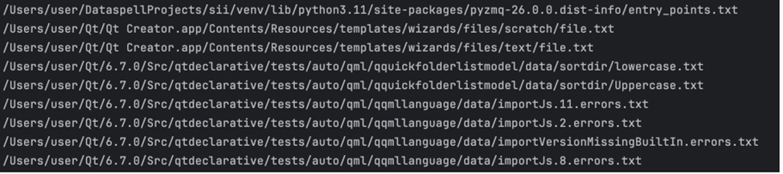

# Практическое занятие №1. Введение, основы работы в командной строке
Задача 1
Вывести отсортированный в алфавитном порядке список имен пользователей в файле passwd
Решение:

	cut -d':' -f1 /etc/passwd | sort

# Решение:


 
# Задача 2

# Решение
cat /etc/protocols | sort -nrk 2 | awk '{print $2, $1}' | head -5


# Задача 3

# Решение
```bash
#!/bin/bash
string=$1
size=${#string}
echo -n "+"
for ((i=-2;i<size;i++))
do
echo -n "-"
done
echo "+"
echo "| $string |"
echo -n "+"
for ((i=-2;i<size;i++))
do
echo -n "-"
done
echo "+"
 ```


# Решение
grep -o '\b[a-zA-Z_][a-zA-Z0-9_]*\b' main.cpp | sort | uniq
 


# Решение
```bash
#!/bin/bash

chmod +x "$1"
sudo cp "$1" /usr/local/bin/
```
# Задание 6
 Написать программу для проверки наличия комментария в первой строке файлов с расширением c, js и py.
```bash
 #!/bin/bash
for file in "$@"; do
  if [[ "$file" =~ \.(c|js|py)$ ]]; then
    first_line=$(head -n 1 "$file")

    if [[ "$file" =~ \.c$ && "$first_line" =~ ^// ]] || \
       [[ "$file" =~ \.js$ && "$first_line" =~ ^// ]] || \
       [[ "$file" =~ \.py$ && "$first_line" =~ ^# ]]; then
      echo "$file has a comment in the first line."
    else
      echo "$file does not have a comment in the first line."
    fi
  fi
done
```


# Задание 7
Написать программу для нахождения файлов-дубликатов (имеющих 1 или более копий содержимого) по заданному пути (и подкаталогам).
```bash
#!/bin/bash

temp_file=$(mktemp)
find "$1" -type f -exec md5 -r {} + -maxdepth 1 | sort > "$temp_file"
awk '{seen[substr($0, 1, 32)]++} seen[substr($0, 1, 32)] == 2 {print $2}' "$temp_file"

rm "$temp_file"
 ```


# Задание 8
Написать программу, которая находит все файлы в данном каталоге с расширением, указанным в качестве аргумента и архивирует все эти файлы в архив tar.
# Решение
```
find . -name "*.$1" -print0 -maxdepth 1 | tar -czvf archive.tar.gz --null -T -
```

# Задание 9
```
sed 's/    /\t/g' "$1" > "$2"
```
 
# Задание 10
```
find "$1" -type f -empty -name "*.txt"
```

